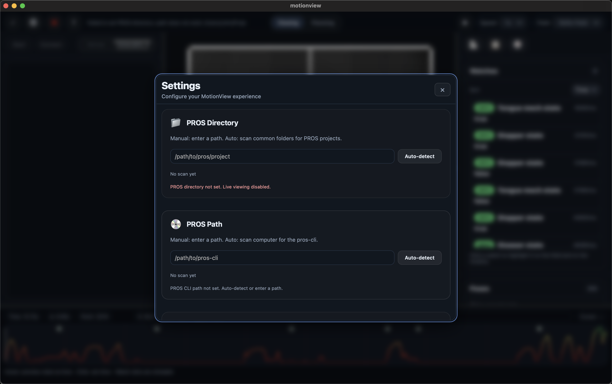

# Setting up **MotionView**
MotionView `Settings` are located inside of the Gear icon, typically near the top left of your MotionView window.

    

MotionView was made to be easy to setup, with auto-detection when available. 
In the case that auto-detection fails, or you have questions, here is where to look

## PROS Project Directory
The **PROS Project Directory** is just the folder where your PROS Project is. 
> The only thing that this field requires is that the folder contain a `project.pros` and the other nessicary PROS files. **It DOES NOT need to contain any relevant code**

If you have an existing PROS Project on your computer, enter its path into the `PROS Project Directory` field of settings.

If you do not have an existing PROS project, create one using the [`PROS Extension`](https://marketplace.visualstudio.com/items?itemName=sigbots.pros).

## PROS-CLI Path
The **PROS-CLI Path** is the path to your `pros` executable file. It's what allows live streaming to open the connection between the controller and the computer.
### Finding it manually
1. Open your code editor (VS Code or Cursor)
2. Open a `PROS Terminal` by:
  - Open the command palate with `Cmd + Shift + P` or `Ctrl + Shift + P`
  - Search: `PROS: Integrated terminal` and click it
3. Navigate to the terminal (which should have automatically opened) and type:
  > which pros (MacOS)  
  > where pros (Windows) 
4. Copy the output of that command and paste it into MotionView Settings: `PROS Path`

### Finding it automatically
1. Open MotionView settings
2. Scroll down to the `PROS Path` setting
3. Click the `Find` button next to the input box.
4. Select the best result
5. If nothing is found, find it manually, or it may not be installed on your system:
> Install the [`PROS Extension`](https://marketplace.visualstudio.com/items?itemName=sigbots.pros), restart the app, and `Find` again.