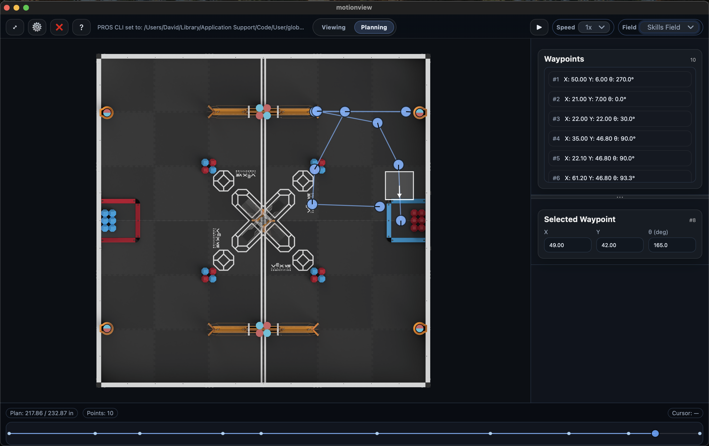

# MotionView - Live PROS Visualizer

    

## What is MotionView?
MotionView is a cross-platform live visualizer built specifically for teams using PROS V5. It turns logged pose data, sensor watches, and live telemetries into an interactive field view so you can see exactly how your robot moved, when events fired, and how closely the actual motion matches the plan.

**It exists** because watching raw terminal output or dumping JSON files makes it hard to spot subtle mistakes, compare two runs, or quickly iterate between planning and testing. MotionView gives you a single place to stream live logs from the controller, play back past recordings, and draft new plans with both the physical field and telemetry values visible at once.

This is made for PROS teams who want faster post-match analysis, easier validation of auto routines, or a dependable visualization tool for clinics and classroom demos. Whether you are a veteran programmer debugging PID tuning or a new team learning how poses and watches relate, MotionView keeps the context you need in plain sight.

### Why PROS?
PROS is needed because of the terminal interface. Because `pros terminal`, run anywhere, always does the same action, it is very easy to get consistent connections and behavior using it. While it may be possible to use VEXCode (or any non-PROS platform), piping the terminal into MotionView is not easily done.

## Quick Start
1. Open MotionView.
2. Use `Cmd + O` to open a file.
3. Download (from this GitHub) & Select the [`Example Route`](MotionView_Example.json) to see a full demo route with poses and watches.
4. Press `Space` to play/pause and hover the field to inspect pose + watch details.

**Main features:**
- Load recorded runs and see the robot path instantly.
- Scrub the timeline and inspect pose, speed, and watch values.
- Switch to Planning mode to draft, compare, and edit a path.
- Livestream runs with one click
- Upload your own Robot Image 

## Why MotionView?
- **Built for PROS teams**: fast to learn, practical for testing.
- **Pose + watch aware**: path, pose, and other important values all in one view.
- **Live or Later**: stream from the robot or open a saved file.
- **Decision-friendly**: compare runs, spot issues, and iterate faster.

## Viewing Mode

    

Use this mode to **replay and analyze** a run.

What you see:
- The field canvas draws the robot path, heading, and live pose playback so you can confirm movement shape, orientation, and speed at each timestamp.
- A timeline scrubber/keyboard stepping lets you jump to specific poses, pause on key moments, or fast-forward to the end of the run.
- The floating info island mirrors the current pose or live update, surfacing pose (x/y/theta), left and right wheel speeds, and the last watch values without needing to hover the field.
- The poses list (below the field) lists every timestamped pose so you can jump directly to meaningful events, and the watches list tallies timed signals (solenoids, pneumatics, etc.) so you can filter for the stories that matter.
 
Key controls:
- Refresh button and interval animate the view on a set cadence when streaming, or you can tap Refresh to pull the latest poses/watches immediately; think of it as reloading the live buffer so the UI matches the source data.
Key capabilities:
- Overlay the planned path or a previous run to compare intent versus execution.
- Toggle live streaming to keep the field updating in real time when connected to a robot, or use file import (`Cmd + O`) to review saved logs.
- Use play/pause, step forward/back, and fit/reset (`F`) to keep attention on the most important moments.

## Planning Mode

    

Use this mode to **plan and refine** a path before testing, or after.

What you interact with:
- Drop waypoints on the field and drag them to adjust radii/positions; each waypoint represents a target pose or action in the plan.
- A specialist timeline shows the planned motion playback, letting you inspect how long the plan takes and how smoothly the robot turns.
- The plan editor exposes undo/redo (`Cmd + Z`/`Cmd + Shift + Z`), nudging with arrow keys, and multiple selection for batch adjustments.

Key capabilities:
- Play back the plan exactly like a recorded run to inspect timing, heading changes, and acceleration before running on the robot.
- Export the plan as JSON or overlay it in Viewing mode to compare with recorded telemetry.
- Clear the plan (`Cmd + K`) to start fresh, or use nudging shortcuts (Shift + arrows for 5× steps) for micro precision.

## Prerequisites
MotionView requires nothing out of the box to load files, but some features require external dependencies. 
1. **Live streaming:** This feature requires you to have both a PROS Project locally on your computer, and to have the [`PROS Extension`](https://marketplace.visualstudio.com/items?itemName=sigbots.pros) installed through `VS Code` or `Cursor`.

## Livestream Setup
Livestreaming lets you watch a robot's pose logger in real time without opening a saved file.

Core requirements:
1. Be connected to your robot (controller/brain) and run a `Posex logger`; for a minimal logger build see [**MVLib**](</Example Project - MVLib/README.md>).
2. Settings must point to a valid `PROS Project Directory`. If you do not have robot code locally, install the PROS VS Code Extension, create a new PROS project, and MotionView will auto-detect it.
3. MotionView autodetects `PROS-CLI`, but refer to the [Setup Guide](MotionView/SETUP_GUIDE.md) if it fails.

What Livestream mode gives you:
- A live-updating field view with the current pose, heading, and speed so you can monitor motion as it happens.
- Watch values appear alongside poses, showing sensor states, pneumatics, or other telemetry the logger emits.
- Controls let you Connect/Disconnect (`C`), start/stop streaming (`S`), auto-follow the robot head, and toggle overlays just like in Viewing Mode.

Use cases:
- Warm up the robot and verify that the logger is working before grabbing a file.
- Compare live motion to saved plans to confirm sensors/fire sequences are firing when expected.
- Capture a run simply by letting it stream and hitting `Cmd + O` to save the generated log afterward if needed.

## Keybinds

**Legend:** `Cmd` on macOS, `Cmd` means `Ctrl` on Windows/Linux.

| Context | Keybind | Action |
|---|---|---|
| Global | `Cmd + 1` | Switch to Viewing mode |
| Global | `Cmd + 2` | Switch to Planning mode |
| Global | `Cmd + Shift + K` | Clear everything (field + plan) |
| Global | `F` | Fit/reset field position |
| Global | `Cmd + T` | Toggle Floating info panel |
| Viewing | `Space` | Play/Pause playback (or toggle Auto‑follow Head when live‑connected) |
| Viewing | `Cmd + O` | Open JSON file |
| Viewing | `Cmd + K` | Clear Viewer |
| Viewing | `S` | Start/stop live streaming (if connected) |
| Viewing | `P` | Toggle Planned Overlay |
| Viewing | `C` | Connect/disconnect |
| Viewing | `←` / `→` | Step to previous/next pose |
| Planning | `Space / S` | Play/Pause plan playback |
| Planning | `Delete` / `Backspace` | Delete selected waypoint(s) |
| Planning | `←` / `→` / `↑` / `↓` | Nudge selected waypoint(s) |
| Planning | `Shift + ←/→/↑/↓` | Nudge selected waypoint(s) by 5× step |
| Planning | `Cmd + Z` | Undo |
| Planning | `Cmd + Shift + Z` | Redo |
| Planning | `Cmd + K` | Clear planned path |
