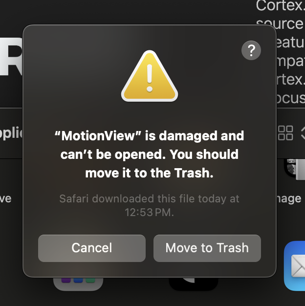

# Running MotionView

## Install MotionView
1. Download MotionView from the official [GitHub release page](https://github.com/lewispinstein-hue/MotionView/tree/main/Releases/MacOS)
3. Double-click the downloaded file.
4. When prompted, drag MotionView.app into your Applications folder.

## macOS Gatekeeper Fix (only needed once)
macOS blocks all apps that aren’t notarized by Apple, even perfectly safe open-source tools. To let macOS know you trust this app, run:

```zsh
xattr -dr com.apple.quarantine /Applications/MotionView.app
```

If the path differs, copy it directly from Finder inside the Applications folder (Right-click → Option-key → “Copy as Path”) and paste it:

```zsh
xattr -dr com.apple.quarantine "<path you copied>"
```

After this, MotionView should launch normally.

## If You See: “MotionView is damaged and can’t be opened”
This is a standard macOS warning for non-notarized apps — not an indication of corruption. Removing the quarantine flag (Step 2) resolves it.
macOS treats *every* non-notarized app this way.

<p align="left">
    
</p>

## Why macOS Blocks It
I’m not currently enrolled in Apple’s Developer Program, which means:
- MotionView cannot yet be notarized by Apple.
- macOS flags all non-notarized apps by default.
- Removing the quarantine flag is the official way to run open-source tools distributed outside the App Store. <br>
> This is the same process used for many GitHub-distributed developer tools and robotics programs.